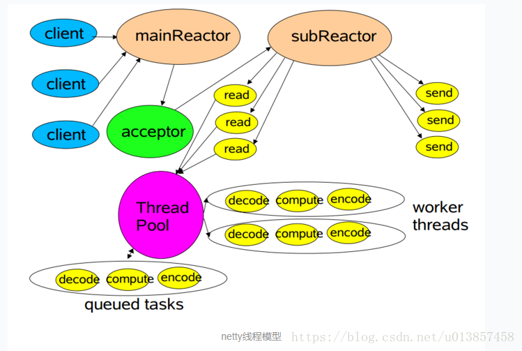
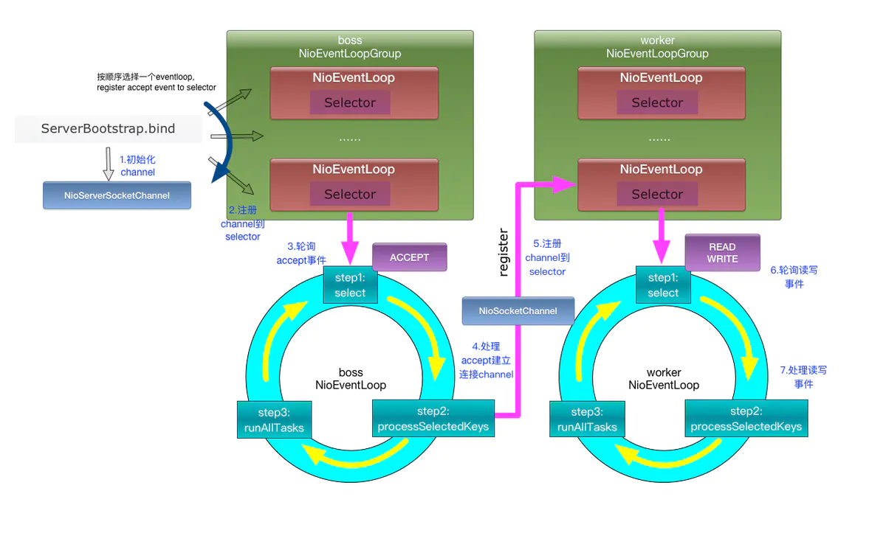

# Netty NIO笔记

## Netty架构

Netty NIO对`Java NIO` 进行了封装，简化了`Java NIO`编码工作和存在的BUG。

### Reactor线程模型

在介绍Netty线程模型之前，先简单介绍Reactor线程模型，Reactor是基于事件驱动的模型，分为三个角色：

- Acceptor：负责接收Accept事件，然后将连接注册成读事件，传递给dispatch;
- Dispatch：负责分发事件，如果是接收到Accept事件,则分发给Acceptor。如果是Read事件，将请求交给ReadHandler处理；
- Handler：负责处理具体事件；

Reactor线程模型关注的是：任务接受之后，对处理过程继续进行切分，划分为多个不同的步骤，每个步骤用不同的线程来处理，也就是原本由一个线程处理的任务现在由多个线程来处理，每个线程在处理完自己的步骤之后，还需要将任务转发到下阶段线程继续进行处理。

Netty中的Reactor模型如下：



其中mainReactor线程池负责处理连接请求；当acceptor接受连接后会将连接注册到subReactor的线程上；由subReactor来处理IO请求；而ThreadPool可以用来处理耗时的业务逻辑。虽然 Netty 的线程模型基于主从 Reactor 多线程模型，但是做了部分调整和修改，将acceptor变成了mainReactor中的一个线程，并且默认使用subReactor线程池中的线程来处理compute工作，同时也支持使用独立的线程池处理compute工作，这需要进行手动配置。

### Netty线程模型



#### Netty组件

##### NioEventLoop和NioEventLoopGroup

NioEventLoopGroup实际上就是一个线程池，线程池中有多个NioEventLoop工作线程，如果不进行手动设置默认工作线程数量为物理机cpu核心数量的2倍。

每个NioEventLoop都绑定了一个Selector用于监听注册到Selector的Channel的IO事件，NioEventLoop的工作包括IO事件监听、IO事件处理、以及交给NioEventLoop的其他任务三个部分。由于Netty模型中有多个NioEventLoop，所以存在多组Selector在监听IO就绪事件。

一个NioEventLoop的Selector可以被多个Channel注册，也就是说多个Channel共享一个EventLoop。EventLoop的Selecctor对所以绑定到NioEventLoop的Channel的IO事件进行监听。但一个Channel只能绑定到一个NioEventLoop相当于一个连接绑定一个线程，这个连接所有的ChannelHandler都是在一个线程中执行的，避免了多线程干扰。更重要的是ChannelPipline链表必须严格按照顺序执行的。单线程的设计能够保证ChannelHandler的顺序执行。

> 在监听一个端口的情况下，一个NioEventLoop通过一个NioServerSocketChannel监听端口，处理TCP连接请求。后端多个NioEventLoop工作线程处理IO事件。每个Channel绑定一个NioEventLoop线程，一个NioEventLoop线程关联一个Selector来为多个注册到它的Channel监听IO就绪事件。NioEventLoop是单线程执行，保证ChannelPipline在单线程中执行，保证了ChannelHandler的执行顺序。

##### Channel

Netty中的通道是对Java原生网络API的封装，其顶层接口为Channel。

以TCP编程为例 ，在Java中，有两种方式：

- 基于BIO，JDK1.4之前，我们通常使用java.net包中的ServerSocket和Socket来代表服务端和客户端。

- 基于NIO，Jdk1.4引入nio编程之后，我们使用java.nio.channels包中的ServerSocketChannel和SocketChannel来代表服务端与客户端。

在Netty中，对java中的BIO、NIO编程api都进行了封装，分别为：

- 使用了OioServerSocketChannel，OioSocketChannel对java.net包中的ServerSocket与Socket进行了封装

- 使用NioServerSocketChannel和NioSocketChannel对java.nio.channels包中的ServerSocketChannel和SocketChannel进行了封装。

由于本文只对NIO进行说明，所以就不对BIO相关的内容进行深入，Netty中NIO相关的Channel类关系图如下：


NioServerSocketChannel和NioSocketChannel中都持有对应的Java NIO Channel的引用，所以NioServerSocketChannel注册到NioEventLoop，实际上就是Java NIO Channel注册到绑定在NioEventLoop上的Selector。二者都继承自AbstractNioChannel，其维护了Netty中的Channel与Java NIO中Channel的对应关系，并提供了`javaChannel()`方法获取对应的Java Channel。

```java
public abstract class AbstractNioChannel extends AbstractChannel {
    ...
    private final SelectableChannel ch;
    ...
    // 获取对应的java channel
    protected SelectableChannel javaChannel() {
        return ch;
    }
}
```

SelectableChannel是Java NIO中的类，我们前面提到nio包中的SocketChannel、ServerSocketChannel都是其子类，NioSocketChannel和NioServerSocketChannel对AbstractNioChannel的`javaChannel()`进行了重写，将SelectableChannel强转为对应Java Channel，如下：

- io.netty.channel.socket.nio.NioServerSocketChannel#javaChannel

```java
@Override
// 返回java.nio.channels.ServerSocketChannel
protected ServerSocketChannel javaChannel() {
  return (ServerSocketChannel) super.javaChannel();
}
```

- io.netty.channel.socket.nio.NioSocketChannel#javaChannel

```java
@Override
// 返回java.nio.channels.SocketChannel
protected SocketChannel javaChannel() {
    return (SocketChannel) super.javaChannel();
}
```

在创建NioServerSocketChannel和NioSocketChannel对象时，会在构造函数中为其指定对应的ServerSocket和Socket实例，以NioServerSocketChannel为例：

```java
public class NioServerSocketChannel extends AbstractNioMessageChannel
                             implements io.netty.channel.socket.ServerSocketChannel {
    private static final SelectorProvider DEFAULT_SELECTOR_PROVIDER = SelectorProvider.provider();
    private static ServerSocketChannel newSocket(SelectorProvider provider) {
        try {
           // 生成一个新的ServerSocketChannel对象
           return provider.openServerSocketChannel();
        } catch (IOException e) {
            throw new ChannelException(
                    "Failed to open a server socket.", e);
        }
    }

    public NioServerSocketChannel() {
        this(newSocket(DEFAULT_SELECTOR_PROVIDER));
    }

    public NioServerSocketChannel(SelectorProvider provider) {
        this(newSocket(provider));
    }

  	public NioServerSocketChannel(ServerSocketChannel channel) {
        super(null, channel, SelectionKey.OP_ACCEPT);
        config = new NioServerSocketChannelConfig(this, javaChannel().socket());
    }
    
  	...
}
```

##### ChannelHandler

在NIO编程中，我们经常需要对Channel的输入和输出事件进行处理，Netty抽象出一个ChannelHandler概念，专门用于处理此类事件，因此编写Handler是我们进行Netty框架编程时主要编码工作。IO事件分为出站和入站，因此ChannelHandler又具体的分为ChannelInboundHandler和ChannelOutboundHandler ，分别用于出站和入站时某个阶段事件的处理。

ChannelHanler的类关系图如下：


ChannelHandlerAdapter、ChannelInboundHandlerAdapter 、ChannelOutboundHandlerAdapter是Netty提供的Handler骨架类已经实现了大部分骨架方法，对于不同的需求你只要相应的Handler并重写自己感兴趣的方法即可。这里再简单介绍一下SimpleChannelInboundHandler和ChannelInitializer这两个类：

- SimpleChannelInboundHandler

	SimpleChannelInboundHandler继承自ChannelInboundHandlerAdapter用于处理入站信息，需要指定泛型即该Handler需要处理的对象类型，当传入对象类型不正确时不进行数据处理。使用时只需要实现`channelRead0`方法进行数据处理即可，使用该类好处在于SimpleChannelInboundHandler会自动为你释放ReferenceCounted类型对象（例如ByteBuf）.

- ChannelInitializer

	ChannelInitializer类的`initChannel`方法会在Channel初始化被调用，所以一般通过重写`initChannel`方法配置pipline中的ChannelHandler链。

在处理Channel的IO事件时，为了使逻辑更清晰和代码的简洁性通常会将数据处理过程分为几个阶段。以入站信息为例，通常的处理逻辑如下：

处理半包或者粘包问题-->数据的解码(或者说是反序列化)-->数据的业务处理

可以看到不同的阶段要执行不同的功能，因此通常我们会编写多个ChannelHandler，来实现不同的功能。而且多个ChannelHandler之间的顺序不能颠倒，例如我们必须先处理粘包解包问题，之后才能进行数据的业务处理。

##### ChannelPipline

Netty通过ChannelPipline来保证多个ChannelHandler之间的顺序调用，具体是通过一个双向链表实现的，下文将会进行介绍。在每个Channel被创建时，都会自动创建一个ChannelPipeline对象，我们可以通过io.netty.channel.Channel对象的pipeline()方法获取这个对象实例。

ChannelPipeline创建是在AbstractChannel类的构造方法中，所以Netty中每个Channel都会拥有和维护一个唯一的ChannelPipeline，如下：

```java
public abstract class AbstractChannel extends DefaultAttributeMap implements Channel {
    ....
    private final DefaultChannelPipeline pipeline;
    ....
    
    protected AbstractChannel(Channel parent) {
        this.parent = parent;
        id = newId();
        unsafe = newUnsafe();
        // 初始化pipline
        pipeline = newChannelPipeline();
    }
    ....
   
    // 创建一个DefaultChannelPipeline并把Channel自身作为引用传入
    protected DefaultChannelPipeline newChannelPipeline() {
        return new DefaultChannelPipeline(this);
    }
    ....
    
    @Override
    // 返回pipeline实例
    public ChannelPipeline pipeline() {
        return pipeline;
    }
}
```

从上述代码中，我们可以看到ChannelPipleLine的具体创建过程实际上是通过return new DefaultChannelPipeline(this)实现的。DefaultChannelPipeline是ChannelPipeline的默认实现类。

我们可以通过ChannelPipeline的`addXX`方法向pipline的双向链表中添加Handler来维护Handler之间的调用关系，常用的添加方法有`addBefore, addAfter, addLast`等。

> 1、默认情况下，一个ChannelPipeline实例中，同一个类型ChannelHandler只能被添加一次，如果添加多次，则会抛出异常，具体参见io.netty.channel.DefaultChannelPipeline#checkMultiplicity。如果需要多次添加同一个类型的ChannelHandler的话，则需要在该ChannelHandler实现类上添加@Sharable注解。
>
> 2、在ChannelPipeline中，每一个ChannelHandler都是有一个名字的，而且名字必须的是唯一的，如果名字重复了，则会抛出异常，参见io.netty.channel.DefaultChannelPipeline#checkDuplicateName。
>
> 3、如果添加ChannelHanler的时候没有显示的指定名字，则会按照规则其起一个默认的名字。具体规则如下，如果ChannelPipeline中只有某种类型的handler实例只有一个，如XXXHandler,YYYHandler，则其名字分别为XXXHandler#0，YYYHandler#0，如果同一类型的Handler有多个实例，则每次之后的编号加1。具体可参见io.netty.channel.DefaultChannelPipeline#generateName方法。

##### ChannelHandlerContext

前面提到可以通过ChannelPipeline的添加方法，按照顺序添加ChannelHandler，并在之后按照顺序进行调用。事实上，每个ChannelHandler会被先封装成ChannelHandlerContext，之后再封装进ChannelPipeline中，所以ChannelPipline维护的双向链表实际上是ChannelHandlerContext构成的链表。以DefaultChannelPipeline的addLast方法为例：

```java
@Override
public ChannelPipeline addLast(EventExecutorGroup group, final String name, ChannelHandler handler) {
    synchronized (this) {
        // 检查这种类型的handler实例是否允许被添加多次
        checkDuplicateName(name);
       	// 将handler包装成一个DefaultChannelHandlerContext类
        AbstractChannelHandlerContext newCtx = new DefaultChannelHandlerContext(this, group, name, handler);
        // 维护AbstractChannelHandlerContext的先后关系
        addLast0(name, newCtx);
    }

    return this;
}
```

可以看到的确是先将ChannelHandler当做参数构建成一个DefaultChannelHandlerContext实例之后，再调用addLast0方法维护ChannelHandlerContext的先后关系，从而确定了ChannelHandler的先后关系。可以注意到ChannelHandlerContext对象持有ChannelPipeline、EventExecutorGroup、ChannelHandler对象的引用，因此ChannelHandlerContext可以方便得获得和使用这些对象，当有方法的参数为ChannelHandlerContext时就可以很方便地使用其引用的对象，我觉得这应该是将Handler封装为ChannelHandlerContext的主要原因。

DefaultChannelPipeline内部是通过一个双向链表记录ChannelHandler的先后关系，内部通过两个哨兵节点HeadContext和TailContext作为链表的开始和结束，双向链表的节点是AbstractChannelHandlerContext类。以下是AbstractChannelHandlerContext类的部分源码(双向链表节点)：

```java
public class DefaultChannelPipeline implements ChannelPipeline {
    ...
    private static final String HEAD_NAME = generateName0(HeadContext.class);
    private static final String TAIL_NAME = generateName0(TailContext.class);
    ...
    final AbstractChannelHandlerContext head;
    final AbstractChannelHandlerContext tail;

    private final Channel channel;
    ....
    protected DefaultChannelPipeline(Channel channel) {
        this.channel = ObjectUtil.checkNotNull(channel, "channel");
        ....
        // 创建双向链表头部元素实例
        tail = new TailContext(this);
        head = new HeadContext(this);
        // 创建双向链表的尾部元素实例
        head.next = tail;
        tail.prev = head;
    }
    ....
    ....
    private void addLast0(AbstractChannelHandlerContext newCtx) {
       	// 设置ChannelHandler的先后顺序关系
        AbstractChannelHandlerContext prev = tail.prev;
        newCtx.prev = prev;
        newCtx.next = tail;
        prev.next = newCtx;
        tail.prev = newCtx;
       }
     }
}
```

头尾两个节点与其他Handler不同点在于，它们持有了Unsafe对象，从而能通过Unsafe对象对Java NIO组件进行操作。

## Netty源码分析

### 从服务端的初始化说起

让我们以一个简单的EchoServer为例子进行说明：

```java
public class EchoServer {
    private final int port;

    public EchoServer(int port) {
        this.port = port;
    }

    public void start() throws Exception {
        // boss线程池，用于接受连接请求
        EventLoopGroup boss = new NioEventLoopGroup(1);
        // workers线程池，用于执行IO请求
        EventLoopGroup workers = new NioEventLoopGroup();

        try {
            // 启动类，用于配置并辅助启动服务
            ServerBootstrap b = new ServerBootstrap();
            // 配置线程池
            b.group(boss, workers)
                // 设置要启动的Channel类型
                .channel(NioServerSocketChannel.class)
                // 配置子Channel的Handler链
                .childHandler(new EchoServerInitializer());
            
            // 线程绑定监听端口，启动Netty服务端
            ChannelFuture f = b.bind(port).sync();
            f.channel().closeFuture().sync();
        } finally {
            boss.shutdownGracefully();
            workers.shutdownGracefully();
        }
    }
}
```

可以看出在Netty服务启动之前，主要进行了Netty服务参数配置，其含义我们先按下不表，真正的开启服务的方法很显然是ServerBootstrap的`bind`方法，bind方法的调用链如下：

```java
public ChannelFuture bind(int inetPort) {
    // 使用端口号创建InetSocketAddress作为参数
    return bind(new InetSocketAddress(inetPort));
}

public ChannelFuture bind(SocketAddress localAddress) {
    // 校验工作
    validate();
    if (localAddress == null) {
        throw new NullPointerException("localAddress");
    }
    return doBind(localAddress);
}

// 核心方法
private ChannelFuture doBind(final SocketAddress localAddress) {
    // 创建接受连接请求的Channel并注册到NioEventLoop的Selector
    final ChannelFuture regFuture = initAndRegister();
    final Channel channel = regFuture.channel();
    if (regFuture.cause() != null) {
        return regFuture;
    }

    // 判断操作是否完成
    if (regFuture.isDone()) {
        ChannelPromise promise = channel.newPromise();
        // 如果操作完成调用doBind0方法
        doBind0(regFuture, channel, localAddress, promise);
        return promise;
    } else {
        final PendingRegistrationPromise promise = new PendingRegistrationPromise(channel);
        // 如果操作还未完成则添加监听器，在完成后判断操作是否失败，如果未失败则继续调用doBind0方法
        regFuture.addListener(new ChannelFutureListener() {
            @Override
            public void operationComplete(ChannelFuture future) throws Exception {
                Throwable cause = future.cause();
                if (cause != null) {
                    promise.setFailure(cause);
                } else {
                    promise.registered();
                    doBind0(regFuture, channel, localAddress, promise);
                }
            }
        });
        return promise;
    }
}
```

通过bind方法的调用链，最终将调用ServerBootstrap的doBind方法，doBind主要有两个步骤一是通过`initAndRegister`方法创建Channel并注册注册到NioEventLoop的Selector上用于接受连接请求；二是通过`doBind0`方法将Java管道绑定到要监听的端口。

现在我们依次分析这两个方法，首先来看`initAndRegister`方法

```java
final ChannelFuture initAndRegister() {
    Channel channel = null;
    try {
        // 使用channelFactory创建NioSocketChannelServer
        channel = channelFactory.newChannel();
        // 初始化管道
        init(channel);
    } 
    // 如果创建或初始化管道失败了，返回包含错误原因的ChannelFuture
    catch (Throwable t) {
        if (channel != null) {
            channel.unsafe().closeForcibly();
            return new DefaultChannelPromise(channel, GlobalEventExecutor.INSTANCE).setFailure(t);
        }
        return new DefaultChannelPromise(new FailedChannel(), GlobalEventExecutor.INSTANCE).setFailure(t);
    }

    // 将管道注册到NioEventLoop的Selector上
    ChannelFuture regFuture = config().group().register(channel);
    if (regFuture.cause() != null) {
        if (channel.isRegistered()) {
            channel.close();
        } else {
            channel.unsafe().closeForcibly();
        }
    }

    return regFuture;
}
```

我们可以将`initAndRegister`方法的逻辑拆分成三个部分：

**使用ChannelFactory创建Channel**

ChannelFactory是怎么来的呢，让我们回到调用EchoServe类调用bind方法启动之前的配置逻辑上来：

```java
// 配置线程池
b.group(boss, workers)
    // 设置要启动的Channel类型
    .channel(NioServerSocketChannel.class)
    // 配置子Channel的Handler链
    .childHandler(new EchoServerInitializer());
```

其中channel方法配置了管道类型为NioServerSocketChannel.class，让我们进入该方法的调用链：

```java
public B channel(Class<? extends C> channelClass) {
    if (channelClass == null) {
        throw new NullPointerException("channelClass");
    }
    // 以channelClass为参数，这里是NioServerSocketChannel.class，创建ReflectiveChannelFactory
    return channelFactory(new ReflectiveChannelFactory<C>(channelClass));
}

public B channelFactory(io.netty.channel.ChannelFactory<? extends C> channelFactory) {
    return channelFactory((ChannelFactory<C>) channelFactory);
}

public B channelFactory(ChannelFactory<? extends C> channelFactory) {
    if (channelFactory == null) {
        throw new NullPointerException("channelFactory");
    }
    if (this.channelFactory != null) {
        throw new IllegalStateException("channelFactory set already");
    }

    // 将ServerBootstrap的channelFactory设置为ReflectiveChannelFactory
    this.channelFactory = channelFactory;
    return self();
}
```

可以看到`channel`为ServerBootstrap创建了ReflectiveChannelFactory对象，并用它初始化了ServerBootstrap的channelFactory域。

现在让我们回到`channelFactory.newChannel()`逻辑，进入newChannel方法，如下：

```java
public T newChannel() {
    try {
        return constructor.newInstance();
    } catch (Throwable t) {
        throw new ChannelException("Unable to create Channel from class " + constructor.getDeclaringClass(), t);
    }
}
```

newChannel方法通过反射调用创建了Channel对象，从上面的分析可以知道这里的Channel类为NioServerSocketChannel

所以让我们进入NioServerSocketChannel的无参构成函数的调用链，如下：

```java
public NioServerSocketChannel() {
    // 
    this(newSocket(DEFAULT_SELECTOR_PROVIDER));
}

private static ServerSocketChannel newSocket(SelectorProvider provider) {
    try {
        return provider.openServerSocketChannel();
    } catch (IOException e) {
        throw new ChannelException(
            "Failed to open a server socket.", e);
    }
}

public NioServerSocketChannel(ServerSocketChannel channel) {
    super(null, channel, SelectionKey.OP_ACCEPT);
    config = new NioServerSocketChannelConfig(this, javaChannel().socket());
}

protected AbstractNioMessageChannel(Channel parent, SelectableChannel ch, int readInterestOp) {
    super(parent, ch, readInterestOp);
}

protected AbstractNioChannel(Channel parent, SelectableChannel ch, int readInterestOp) {
    super(parent);
    this.ch = ch;
    this.readInterestOp = readInterestOp;
    try {
        ch.configureBlocking(false);
    } catch (IOException e) {
        try {
            ch.close();
        } catch (IOException e2) {
            if (logger.isWarnEnabled()) {
                logger.warn(
                    "Failed to close a partially initialized socket.", e2);
            }
        }

        throw new ChannelException("Failed to enter non-blocking mode.", e);
    }
}
```


## Ref

https://blog.csdn.net/u013857458/article/details/82527722

https://blog.csdn.net/dk243553650/article/details/83062573

